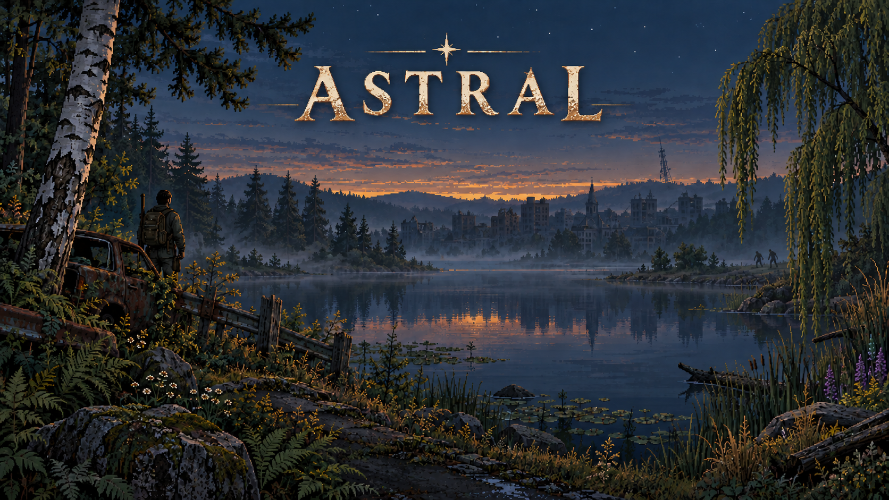
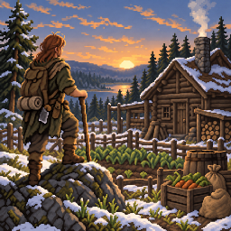
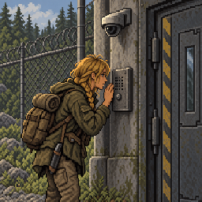
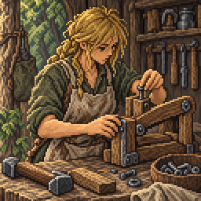
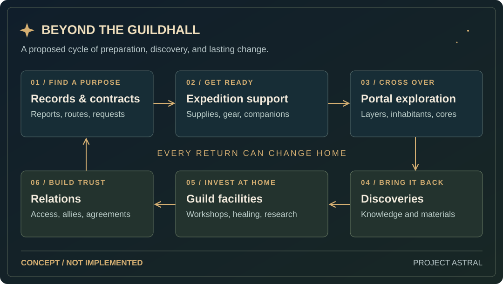

<p align="center">
  
</p>

# Project Astral — CDDA Astral Client & Tileset

**A mouse-friendly survival client today. A portal-fantasy adventure taking shape for tomorrow.**

Project Astral is an independent fork of **Cataclysm: Dark Days Ahead**, bringing mouse-friendly controls, clearer equipment management, an illustrated achievement system, and a growing collection of original artwork to CDDA's survival sandbox.

Its longer-term direction is **isekai and portal fantasy**: expeditions into persistent pocket worlds, layered dungeons with cores to confront, and overworld guild settlements shaped by what adventurers discover and bring home.

**This playtest adds Portal Delver starts, persistent portal pockets, four biomes and guild buildings. New world required (region data changed). Art and placement are still work in progress.**

[Download](#astral-downloads) · [Current features](#current-astral-features) · [Development previews](#in-development) · [Future direction](#the-portal-fantasy-direction) · [Controls & updater guide](doc/hybrid/README.md)

## Astral downloads

The client and artwork are **separate downloads**. You can use the client with other compatible tilesets, or install Astral artwork into a compatible CDDA installation without replacing its executable.

| Download | What you get |
| --- | --- |
| **[Astral Client 0.1.6](https://github.com/Vassteel/CDDA-Astral-Client-Tileset/releases/tag/client-v0.1.6)** | Full clients for **Linux / SteamOS** and **Windows x64**, with launchers and updaters. |
| **[Astral Tileset 0.1.46](https://github.com/Vassteel/CDDA-Astral-Client-Tileset/releases/tag/tileset-v0.1.46)** | Standalone Astral artwork, seasonal trees and plants, shield sprites, and an included **UltiCa fallback**. |

For Client 0.1.6, download the **full client** for your platform; this release includes game-data changes. Extract into a new folder. Keep old saves backed up; start a new world for the changed region data. Settings can be copied while the game is closed. To add the tileset, extract its `gfx/Astral` folder into your game installation and select **Astral** in Graphics.

[All releases and checksums](https://github.com/Vassteel/CDDA-Astral-Client-Tileset/releases) · [Installation, updates and rollback](doc/hybrid/README.md#client-updates)

## Current Astral features

### Portal and world-generation playtest

Portal Delvers can explore persistent pocket worlds with meadow, drowned-lowland, fungal and root-country biomes. Biome layers and 85% dominant-biome mixing shape the routes, with rivers, lakes, dirt paths and a water-heavy second floor. Followers can travel through gateways and back. Town generation includes guild buildings and service-shop layouts; full guild services and contracts remain future work.

Biome and guild artwork still use placeholder fallbacks; some gateway-related ids also fall back to existing art. Water and path placement are first-pass. Test a Delver start, take a follower through and back, find a guild building in a size-11-or-larger town, and walk for a day on floor 1. Report empty stretches and whether floor 2 has too much or too little water.


### Mouse-friendly controls, with familiar keyboard bindings

Menus and inventory selectors offer visible controls for selecting, confirming, cancelling, inspecting, filtering, and choosing quantities. Pickup includes Wear and Wield actions; trade and ammunition selectors expose their own relevant controls. Existing keyboard bindings remain available.

The HUD brings together character information, messages, a minimap, Missions, and workstation controls. Common actions are accessible from the on-screen toolbar, keeping essential interactions close to the map.

### Equipment, clothing layers and weapon holders

Manage gear through a visual equipment interface with **drag-and-drop changes**, clothing layers, and separate scabbard, sheath, and holster destinations. Preview a change before applying it, or cancel it and keep your current equipment.

Equipment still follows CDDA's wear and storage rules: a displayed holder represents actual equipment and capacity. A more detailed equipment interface is being developed below.

### Workstations with relevant actions

Use workstation controls to access the actions supported by the selected station. Fuel transfers let you choose quantities from stacks and review the amounts before confirming, making routine workshop management easier to handle with the mouse.

### Illustrated achievements and a reward bank

The achievement interface presents the **211 vanilla achievement goals**, with illustrations and views for progress, claimable rewards, completed goals, and the reward bank. Supported rewards can be claimed and kept in the bank for later use; reward state persists with the character.

The additional Astral achievement expansion is **shelved**. The current achievement list uses the vanilla goals.

<table>
  <tr>
    <td align="center"></td>
    <td align="center"></td>
    <td align="center"></td>
  </tr>
  <tr>
    <td align="center">Survival</td>
    <td align="center">Exploration</td>
    <td align="center">Craft and skill</td>
  </tr>
</table>

*Examples from Astral's achievement artwork.*

### Separate artwork, shared survival foundation

Astral's art direction combines seasonal landscapes, detailed flora, creatures, and equipment with a consistent pixel-art style. The published tileset includes seasonal trees and plants, shield artwork, and UltiCa fallback for content without an Astral replacement.

Artwork and client releases have independent version numbers. Newer art previews and local development packages may go beyond the public tileset linked above.

### Linux / SteamOS and Windows distribution

Both client downloads include an updater. Client updates and tileset releases are tracked separately, and updater-managed installations support backups and rollback. Update installation requires the game to be closed. See the [updater guide](doc/hybrid/README.md#client-updates) for package support and platform details.

## In development

**These are development builds and ongoing work, not a promise that every feature below is included in Client 0.1.2.** Layouts, balance, and artwork may change before release.

### Equipment and inventory, side by side

The newer equipment layout keeps the survivor preview, equipment groups, and carried inventory visible together. Expand Head, Body, Arms, Hands, Waist, Legs, Feet, or Back to inspect the relevant items and layers; use search, filters, and list or grid views to find equipment.

Drag items between inventory and compatible equipment destinations, then review and apply the change. Main-hand equipment and the shield-based off-hand position are visible alongside the character. **General dual wielding and selected-hand firearm support remain future work.**

### Tactical combat controls

A developing combat hotbar exposes **Attack, Guard, Evade, Shield bash, and Recover**, with move and stamina information. Select a target from the map and make combat decisions without opening a separate battle screen. Combat continues to use CDDA's existing time and action system.

The first creature-behavior experiment gives zombie brutes a readable heavy-strike windup. Automatic combat also has developing Aggressive, Balanced, and Defensive policies with interruption conditions. Costs, timing, and behavior still need broader playtesting; current Evade prepares a defensive reaction in place.

### Character creation and progression interfaces

Recent interface work brings character-creation selections and details into one window and improves appearance-picker cancellation. Progression work is also bringing perk selection into a searchable interface with visible costs, requirements, and confirmation before learning a choice.

### More Astral artwork

Ongoing art work expands plants, wildlife, terrain, and item coverage. The aim is to finish related families together: seasonal variants, relevant growth or life stages, harvested or dead states, and connected terrain where appropriate. Reused fallback tiles are not counted as new original artwork.

## Planned interface work

These items are **design plans**, separate from the development features above:

- **Construction planning:** place building previews with single, line, rectangle, and outline tools; review materials; deliver supplies; and pause or resume construction through normal game activities. Initial scope is floors, walls, doors, and simple furniture.
- **Broader hand and equipment support:** develop consistent handling for a second held item, off-hand attacks, and selected-hand firearms, while respecting item ownership, grip requirements, and action costs.
- **Interface polish:** continue improving equipment readability, artwork, screen-size behavior, and mouse/keyboard access, with further controller and platform validation.

## The portal-fantasy direction

**Future direction beyond the current pocket-world and guild-building playtest.** This is the direction being explored for Project Astral, rather than a fixed feature list or development order.

The ambition is to build on survival, crafting, and exploration with places worth learning about, returning to, and changing. Modern equipment, magical knowledge, unfamiliar materials, and relationships could all become ways to progress.

### Persistent pocket worlds and layered dungeons

Enter a portal from the overworld and discover a smaller, persistent world. A dungeon's layers could include forests, flooded settlements, caverns, ruins, or other environments, each with its own resources, hazards, inhabitants, and routes deeper inside.

Expeditions would build on earlier visits: knowledge of a safe passage, supplies left at a camp, a negotiated agreement, or a newly understood threat. The current playtest establishes pocket persistence and return travel; richer expedition systems remain planned.

### A core worth making a decision about

Reaching the core would create several possible outcomes:

| Choice | Intended consequence |
| --- | --- |
| **Destroy** | End a threat, with possible consequences for the world and people sustained by the core. |
| **Claim** | Gain control or a foothold, along with responsibilities for what happens there. |
| **Bargain** | Establish access, trade, or an alliance with a core that retains its own interests. |

The aim is for each choice to depend on what the player discovers about that particular dungeon.

### Guildhalls as a home between expeditions

Overworld guild settlements could connect exploration to five ongoing activities:

| Guild system | What players could do |
| --- | --- |
| **Portal records** | Bring back reports, map routes, identify hazards, and improve incomplete knowledge of other worlds. |
| **Contracts** | Scout, retrieve materials, escort specialists, rescue missing parties, or investigate a core. |
| **Expedition support** | Arrange supplies, recruit help, store equipment, and prepare for longer journeys. |
| **Facilities** | Develop workshops, an infirmary, libraries, and research spaces using discoveries brought home. |
| **Relations** | Build trust, negotiate dungeon access, manage disputes, and maintain agreements with inhabitants and cores. |

<p align="center">
  
</p>

*A proposed full guild gameplay loop. Portal travel and guild-building layouts are in the playtest; contracts, services and progression remain in development.*

A scout, crafter, healer, or negotiator could make a meaningful contribution without conquering every dungeon. A recovered plant might support the infirmary; a rediscovered technique might expand the workshop; an agreement with a core might open a lasting trade route.

### Settlements, inhabitants and discoveries

The goal is to give settlements recognizable layouts, useful facilities, and a reason to exist. Dungeon history could emerge through architecture, objects, written accounts, and inhabitants with different perspectives.

Believable NPC behavior, dependable companions, settlement generation, coherent lore, and new artwork are substantial development challenges. These systems will need to be proven in playable examples before the setting can expand broadly.

## Follow the project

Join [Project Astral on Discord](https://discord.gg/CPRt9u3pXe). Report bugs in **#bug-reports** with your build hash, platform, mods and reproduction steps.

- **[Releases](https://github.com/Vassteel/CDDA-Astral-Client-Tileset/releases):** published clients and standalone tilesets.
- **[Astral issues](https://github.com/Vassteel/CDDA-Astral-Client-Tileset/issues):** report Astral-specific bugs or suggest improvements. For bugs, include your client/tileset versions, platform, mods, and steps to reproduce.
- **[Controls and development notes](doc/hybrid/README.md):** installation, updater behavior, input controls, and validation details.

Project Astral is an independent fork of [Cataclysm: Dark Days Ahead](https://github.com/CleverRaven/Cataclysm-DDA), not an official CDDA release. Original licensing and credits remain in [LICENSE.txt](LICENSE.txt) and the upstream README below; artwork attribution accompanies the tileset.

---

# Cataclysm: Dark Days Ahead

Cataclysm: Dark Days Ahead is a turn-based survival game set in a post-apocalyptic world. While some have described it as a "zombie game", there is far more to Cataclysm than that. Struggle to survive in a harsh, persistent, procedurally generated world. Scavenge the remnants of a dead civilization for food, equipment, or, if you are lucky, a vehicle with a full tank of gas to get you the hell out of Dodge. Fight to defeat or escape from a wide variety of powerful monstrosities, from zombies to giant insects to killer robots and things far stranger and deadlier, and against the others like yourself, who want what you have...

<p align="center">
    
</p>

## Downloads

**Releases** - [Stable](https://cataclysmdda.org/releases/) | [Experimental](https://cataclysmdda.org/experimental/)

**Source** - The source can be downloaded as a [.zip archive](https://github.com/CleverRaven/Cataclysm-DDA/archive/master.zip), or cloned from our [GitHub repo](https://github.com/CleverRaven/Cataclysm-DDA/).

[](https://github.com/CleverRaven/Cataclysm-DDA/actions/workflows/matrix.yml)
[](https://coveralls.io/github/CleverRaven/Cataclysm-DDA?branch=master)
[](https://www.codetriage.com/cleverraven/cataclysm-dda)
[](https://github.com/CleverRaven/Cataclysm-DDA/graphs/contributors)
[](https://github.com/XAMPPRocky/tokei)
[](https://www.tickgit.com/browse?repo=github.com/CleverRaven/Cataclysm-DDA)

### Packaging status

#### Arch Linux

Ncurses and tiles versions are available in the [community repos](https://www.archlinux.org/packages/?q=cataclysm-dda).

```sh
sudo pacman -S cataclysm-dda
sudo pacman -S cataclysm-dda-tiles
```

#### Fedora

Ncurses and tiles versions are available in the [official repos](https://src.fedoraproject.org/rpms/cataclysm-dda).

```sh
sudo dnf install cataclysm-dda
```

#### Debian / Ubuntu

Ncurses and tiles versions are available in the [official repos](https://tracker.debian.org/pkg/cataclysm-dda).

```sh
sudo apt install cataclysm-dda-curses cataclysm-dda-sdl
```

#### Flatpak

Download from [Flathub](https://flathub.org/apps/org.cataclysmdda.CataclysmDDA).

## Compile

Please read [COMPILING.md](doc/c++/COMPILING.md) - it covers general information and more specific recipes for Linux, OS X, Windows and BSD. See [COMPILER_SUPPORT.md](doc/c++/COMPILER_SUPPORT.md) for details on which compilers we support. And you can always dig for more information in [doc/](https://github.com/CleverRaven/Cataclysm-DDA/tree/master/doc).

We also have the following build guides:
* Building on Windows with `MSYS2` at [COMPILING-MSYS.md](doc/c++/COMPILING-MSYS.md)
* Building on Windows with `vcpkg` at [COMPILING-VS-VCPKG.md](doc/c++/COMPILING-VS-VCPKG.md)
* Building with `cmake` at [COMPILING-CMAKE.md](doc/c++/COMPILING-CMAKE.md)  (*unofficial guide*)

## Contribute

Cataclysm: Dark Days Ahead is the result of contributions from over 1000 volunteers under the Creative Commons Attribution ShareAlike 3.0 license. The code and content of the game is free to use, modify, and redistribute for any purpose whatsoever. See https://creativecommons.org/licenses/by-sa/3.0/ for details.
Some code distributed with the project is not part of the project and is released under different software licenses; the files covered by different software licenses have their own license notices.

Please see [CONTRIBUTING.md](./CONTRIBUTING.md) for details.

Special thanks to the contributors, including but not limited to, people below:
<a href="https://github.com/cleverraven/cataclysm-dda/graphs/contributors">
  
</a>

Made with [contrib.rocks](https://contrib.rocks).

## Community

Forums:
https://discourse.cataclysmdda.org

GitHub repo:
https://github.com/CleverRaven/Cataclysm-DDA

IRC:
`#CataclysmDDA` on [Libera Chat](https://libera.chat), https://web.libera.chat/#CataclysmDDA

Project Astral Discord (bug reports: **#bug-reports**):
https://discord.gg/CPRt9u3pXe

## Frequently Asked Questions

#### Is there a tutorial?

Yes, you can find the tutorial in the **Special** menu at the main menu (be aware that due to many code changes the tutorial may not function). You can also access documentation in-game via the `?` key.

#### How can I change the key bindings?

Press the `?` key, followed by the `1` key to see the full list of key commands. Press the `+` key to add a key binding, select which action with the corresponding letter key `a-w`, and then the key you wish to assign to that action.

#### How can I start a new world?

**World** on the main menu will generate a fresh world for you. Select **Create World**.

#### I've found a bug. What should I do?

Please submit an issue on [our GitHub page](https://github.com/CleverRaven/Cataclysm-DDA/issues/) using [bug report template](https://github.com/CleverRaven/Cataclysm-DDA/issues/new?template=bug_report.yaml). If you're not able to, send an email to `kevin.granade@gmail.com`.

#### I would like to make a suggestion. What should I do?

Please submit an issue on [our GitHub page](https://github.com/CleverRaven/Cataclysm-DDA/issues/) using [feature request template](https://github.com/CleverRaven/Cataclysm-DDA/issues/new?template=feature_request.yaml).
